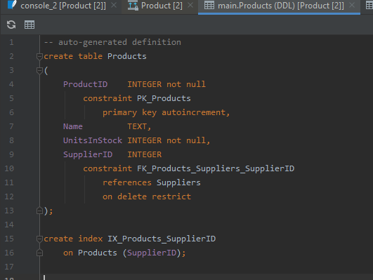
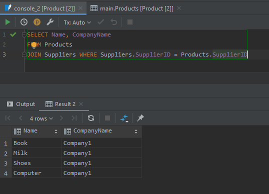
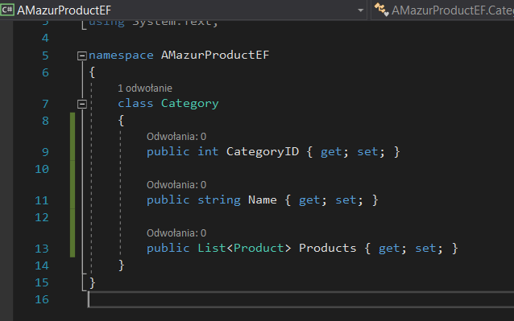

# Entity Framework
## Aleksandra Mazur

### Zadanie I
#### a)
Stworzono projekt typu Console Application .Net Core o nazwie **AMazurProductEF**.

#### b)
Dodano klasę *Product* z polami:
* int ProductID
* string Name
* int UnitsInStock


<div style="page-break-after: always;"></div>

#### c), d)
Stworzono klasę *ProdContext* dziedziczącą po *DbContext* i dodano do niej zbiór (*DbSet*) produktów.


#### e), f)
W Mainie (plik Program.cs) poproszono użytkownika o podanie nazwy produktu i utworzono obiekt produktu o wczytanej nazwie. Następnie dopisano kod pobierający oraz wyświetlający wszystkie produkty.


<div style="page-break-after: always;"></div>

### Zadanie II

Zmodyfikowano model wprowadzając pojęcie Dostawcy - *Supplier* jak poniżej.


Klasa *Supplier* zawiera następujące pola:
* int SupplierID
* string CompanyName
* string Street
* string City


<div style="page-break-after: always;"></div>

Do klasy Product dodano pole Supplier.


Do klasy *ProdContext* dodano kolejny *DbSet*, reprezentujący wszystkich dostawców.


<div style="page-break-after: always;"></div>

Schemat w bazie danych wygląda następująco:




#### d), e), f), g)
Dodano do bazy dwa produkty oraz dostawcę. Następnie znaleziono poprzednio wprowadzone produkty i ustawiono dostawcę każdego z nich na wcześniej stworzonego.


Produkty przed dodaniem dostawcy:


Produkty po przypisaniu dostawcy:


#### g)
Wyświetlono wszystkie produkty wraz z nazwą dostawcy.


<div style="page-break-after: always;"></div>

### Zadanie III
Odwrócono relację zgodnie z poniższym schematem.


Z klasy *Product* usunięto wcześniej dodane pole *Supplier*. Natomiast do klasy *Supplier* dodano listę produktów, dostarczanych przez danego dostawcę.


#### a), b)
Dodano do bazy nowe produkty i stworzono dostawcę. Następnie znaleziono wcześniej wprowadzone produkty i dodano je do produktów dostarczanych przez nowo stworzonego dostawcę.


<div style="page-break-after: always;"></div>

Wypisano wszystkie produkty dostarczane przez dostawcę. 




<div style="page-break-after: always;"></div>

Schemat bazy danych wygląda jak poniżej:


<div style="page-break-after: always;"></div>

### Zadanie IV
Zamodelowano relację dwustronną jak poniżej.


Klasa *Supplier* pozostała bez zmian (z listą dostarczanych przez dostawcę produktów). Z kolei do klasy *Product* dodano pole *Supplier*.


#### a), b)
Stworzono kilka produktów oraz dodano je do produktów dostarczanych przez nowo stworzonego dostawcę (pamiętając o dwustronności relacji).


<div style="page-break-after: always;"></div>

Następnie wyświetlono wszystkie produkty wraz z nazwą dostawcy.


<div style="page-break-after: always;"></div>

### Zadanie V
Dodano klasę *Category* z polami:
* int CategoryID
* string Name
* List \<Product> Products



Schemat bazy danych wygląda jak poniżej.


Do klasy *ProdContext* dodano kolejny *DbSet*, odwzorowujący zbiór kategorii.


<div style="page-break-after: always;"></div>

#### a)
Zmodyfikowano klasę *Product*, dodając do niej pole *Category*.


<div style="page-break-after: always;"></div>

 #### b)
 Stworzono kilka produktów i kilka kategorii.

 
 

<div style="page-break-after: always;"></div>

 #### c)
 Dodano kilka produktów do wybranej kategorii.

 

 

<div style="page-break-after: always;"></div>

 #### d)
 Wypisano wszystkie produkty należące do kategorii *Electronics*.

 

  Jak widać produkty zostały wypisane poprawnie:

 

Następnie wypisano kategorię, do której należy *TV*.

 

 Kategoria produktu również została poprawnie wypisana:

 

 <div style="page-break-after: always;"></div>

 ### Zadanie VI
 Zmodyfikowano relację wiele-do-wielu, jak poniżej.


W celu wykonania powyższej relacji konieczne było stworzenie nowej klasy *InvoiceProduct*, przechowującej relacje między *Invoice* a *Product*. Co więcej do klasy *Product* i *Invoice* dodano listę obiektów *InvoiceProducts*.

 

 

 

 <div style="page-break-after: always;"></div>

Do klasy *ProdContext* dodano jeden *DbSet* odzwierciedlający zbiór faktur oraz drugi - przedstawiający zbiór relacji między produktami a fakturami. Nadpisano również metodę *OnModelCreating*.


<div style="page-break-after: always;"></div>

Schemat bazy danych wygląda następująco:


#### a)
Stworzono kilka produktów, dodano kategorię, dostawcę i "sprzedano" dane produkty na kilku transakcjach.

```csharp
using System;
using System.Linq;
using Microsoft.EntityFrameworkCore;
using Microsoft.EntityFrameworkCore.Design;

namespace AMazurProductEF
{
    class Program
    {
        static void Main(string[] args)
        {
            ProdContext context = new ProdContext();
            // create products, category, supplier and invoices
            Product product1 = new Product { Name = "Turkey" };
            Product product2 = new Product { Name = "Apple" };
            Product product3 = new Product { Name = "Orange" };
            Product product4 = new Product { Name = "Onion" };
            Product product5 = new Product { Name = "Fish" };
            Supplier supplier = new Supplier { CompanyName = "FoodCompany" };
            Category category = new Category { Name = "Food" };
            Invoice invoice1 = new Invoice { InvoiceNumber = 1, Quantity = 3 };
            Invoice invoice2 = new Invoice { InvoiceNumber = 2, Quantity = 3 };

            // add category to products and products to category
            category.Products.Add(product1);
            category.Products.Add(product2);
            category.Products.Add(product3);
            category.Products.Add(product4);
            category.Products.Add(product5);
            product1.Category = category;
            product2.Category = category;
            product3.Category = category;
            product4.Category = category;
            product5.Category = category;

            // add supplier to products and products to supplier
            supplier.Products.Add(product1);
            supplier.Products.Add(product2);
            supplier.Products.Add(product3);
            supplier.Products.Add(product4);
            supplier.Products.Add(product5);
            product1.Supplier = supplier;
            product2.Supplier = supplier;
            product3.Supplier = supplier;
            product4.Supplier = supplier;
            product5.Supplier = supplier;

            // add products, category, supplier and invoices to ProdContext
            context.Products.Add(product1);
            context.Products.Add(product2);
            context.Products.Add(product3);
            context.Products.Add(product4);
            context.Products.Add(product5);
            context.Categories.Add(category);
            context.Suppliers.Add(supplier);
            context.Invoices.Add(invoice1);
            context.Invoices.Add(invoice2);

            // create invoiceProducts
            InvoiceProduct invoiceProduct1 = new InvoiceProduct { Invoice = invoice1, Product = product1 };
            invoice1.InvoiceProducts.Add(invoiceProduct1);
            InvoiceProduct invoiceProduct2 = new InvoiceProduct { Invoice = invoice1, Product = product2 };
            invoice1.InvoiceProducts.Add(invoiceProduct2);
            InvoiceProduct invoiceProduct3 = new InvoiceProduct { Invoice = invoice1, Product = product3 };
            invoice1.InvoiceProducts.Add(invoiceProduct3);
            InvoiceProduct invoiceProduct4 = new InvoiceProduct { Invoice = invoice2, Product = product3 };
            invoice2.InvoiceProducts.Add(invoiceProduct4);
            InvoiceProduct invoiceProduct5 = new InvoiceProduct { Invoice = invoice2, Product = product4 };
            invoice2.InvoiceProducts.Add(invoiceProduct5);
            InvoiceProduct invoiceProduct6 = new InvoiceProduct { Invoice = invoice2, Product = product5 };
            invoice2.InvoiceProducts.Add(invoiceProduct6);

            // add invoiceProducts to ProdContext
            context.InvoiceProducts.Add(invoiceProduct1);
            context.InvoiceProducts.Add(invoiceProduct2);
            context.InvoiceProducts.Add(invoiceProduct3);
            context.InvoiceProducts.Add(invoiceProduct4);
            context.InvoiceProducts.Add(invoiceProduct5);
            context.InvoiceProducts.Add(invoiceProduct6);

            product1.InvoiceProducts.Add(invoiceProduct1);
            product2.InvoiceProducts.Add(invoiceProduct2);
            product3.InvoiceProducts.Add(invoiceProduct3);
            product3.InvoiceProducts.Add(invoiceProduct4);
            product4.InvoiceProducts.Add(invoiceProduct5);
            product5.InvoiceProducts.Add(invoiceProduct6);

            context.SaveChanges();
        }
    }
}
```
Poniżej widać, że dane poprawnie dodały się do bazy.


#### b)
Wypisano produkty sprzedane w ramach wybranej faktury/transakcji.


<div style="page-break-after: always;"></div>

#### d)
Wypisano faktury, w ramach których był sprzedany wybrany produkt.


<div style="page-break-after: always;"></div>

### Zadanie VII
#### Dziedziczenie
#### a)
Wprowadzono do modelu następujące hierarchie.


Klasa *Company* zawiera pola:
* int CompanyID
* string CompanyName
* string Street
* string City
* string ZipCode


Klasa *Customer* zawiera pole:
* float Discount


<div style="page-break-after: always;"></div>

Klasa *Supplier* zawiera pola:
* string BankAccountNumber
* List \<Product> Products


<div style="page-break-after: always;"></div>

Baza danych wygląda następująco:


<div style="page-break-after: always;"></div>

#### b) 
##### TablePerHierarchy
W celu dodania i pobrania z bazy firm, stosując strategię mapowania dziedziczenia *TablePerHierarchy*, zmieniono metodę *OnModelCreating* w klasie *ProdContext*. Zastąpiono również wcześniejszy DbSet dostawców, *DbSet'em* firm. 


Do bazy dodano kilku dostawców i klientów.

```csharp
using System;
using System.Linq;
using Microsoft.EntityFrameworkCore;
using Microsoft.EntityFrameworkCore.Design;

namespace AMazurProductEF
{
    class Program
    {
        static void Main(string[] args)
        {

            ProdContext context = new ProdContext();
            Supplier supplier1 = new Supplier
            {
                CompanyName = "Supplier1",
                City = "Cracow",
                Street = "Kawiory",
                ZipCode = "30-551",
                BackAccountNumber = "123456789",
            };
            context.Add(supplier1);
            Supplier supplier2 = new Supplier
            {
                CompanyName = "Supplier2",
                City = "Warsaw",
                Street = "Aleja Pokoju",
                ZipCode = "33-330",
                BackAccountNumber = "987654321",
            };
            context.Add(supplier2);
            Customer customer1 = new Customer
            {
                CompanyName = "Customer1",
                City = "Paris",
                Street = "Czarnowiejska",
                ZipCode = "32-360",
                Discount = 0.8f,
            };
            context.Add(customer1);
            Customer customer2 = new Customer
            {
                CompanyName = "Customer1",
                City = "London",
                Street = "Downing Street",
                ZipCode = "31-330",
                Discount = 0.5f,
            };
            context.Add(customer2);
            context.SaveChanges();
        }
    }
}
```

Jak widać dane dodały się prawidłowo.


Poniżej pobrano z bazy dane dotyczące dostawców i klientów.


<div style="page-break-after: always;"></div>

##### TablePerType
Niestety strategia mapowania dziedziczenia *TablePerType* nie jest dostępna w wersjach od *3.0 Entity Framework*, więc nie da się wykonać tego podpunktu. Poniżej jednak zostały przedstawione próby wykonania zadania.


<div style="page-break-after: always;"></div>

Schemat bazy wygląda następująco:


Można zauważyć, że w tabeli *Companies* brakuje pola *Discount* należącego do klasy *Customer*.

<div style="page-break-after: always;"></div>

Do bazy dodano poniższe dane:


<div style="page-break-after: always;"></div>

Spróbowano wypisać dodane wcześniej dane.


Dostawcy zostali wypisani poprawnie:


Z kolei przy próbie wypisania klientów, został wyświetlony poniższy wyjątek:


##### TablePerClass
Strategia *TablePerClass* również nie jest możliwa do wykonania, ponieważ metoda *ToTable()*, która jest niezbędna do wykonania tego zadania rzuca błąd od wersji *3.0 Entity Framework*.

