# Hibernate, JPA - laboratorium
## Aleksandra Mazur

### II. Basics
#### a) - h) Konfiguracja
Uruchomiono i podpięto się do serwera *Derby* oraz założono bazę `AMazurJPA`.

Polecenie *show tables* zwróciło poniższe dane.

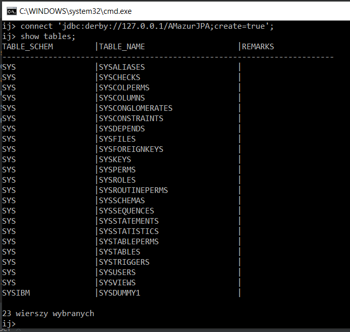

#### i) Projekt Javowy
Utworzono projekt w Intellij o nazwie `AMazurJPAPractice`.

#### j), k) Klasa Product
Stworzono klasę `Product` z polami:
* public int ProductId
* public String ProductName
* public int UnitsOnStock

Uzupełniono w klasie elementy potrzebne do zmapowania jej do bazy danych.

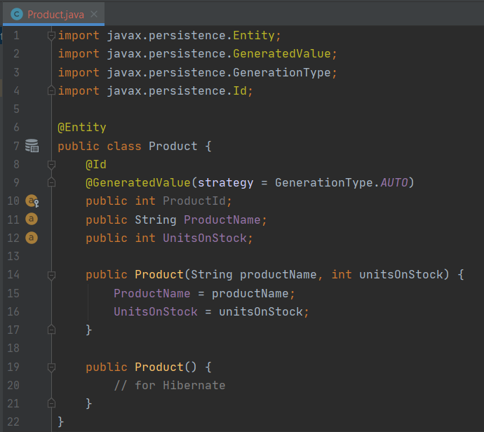

#### l), m) Hibernate config
W pliku `hibernate.cfg.xml` uzupełniono potrzebne property.

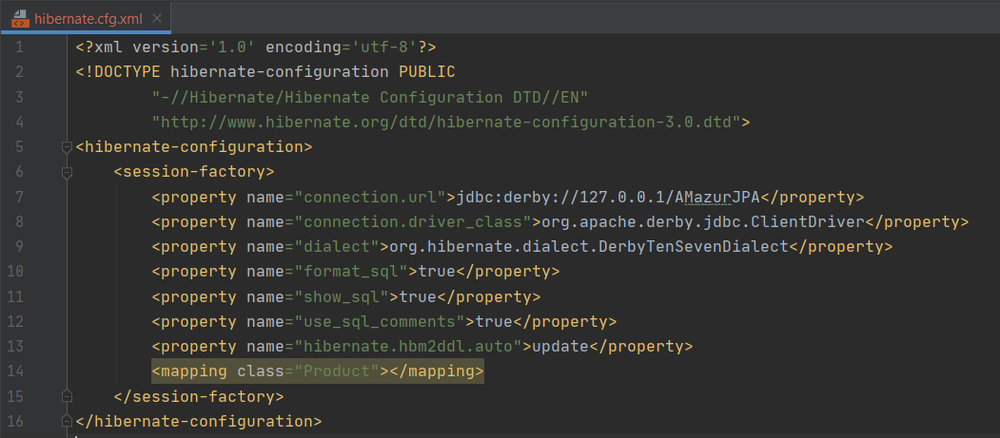

### III. Dodanie produktu

W klasie `Main` stworzono przykładowy produkt i zapisano go do bazy danych.

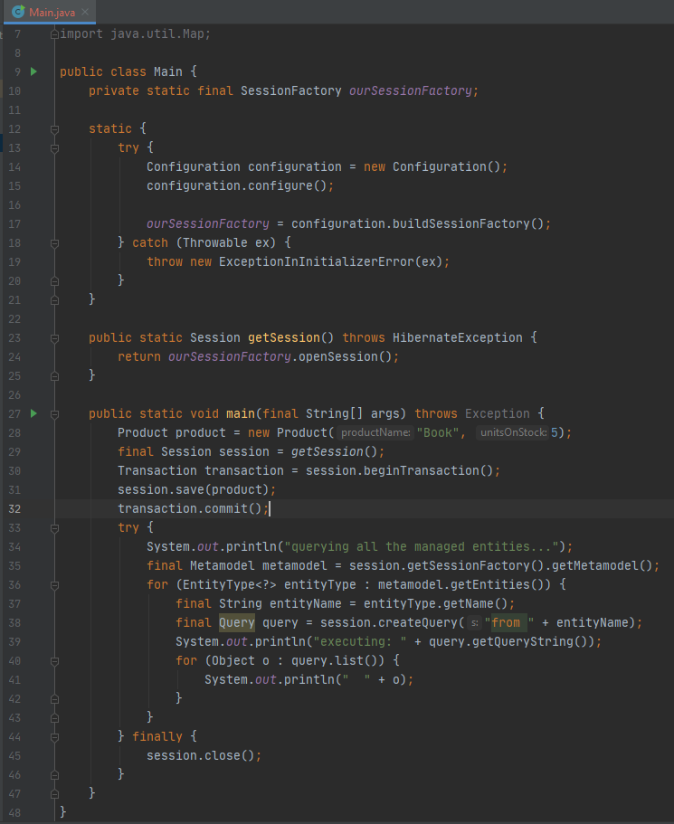

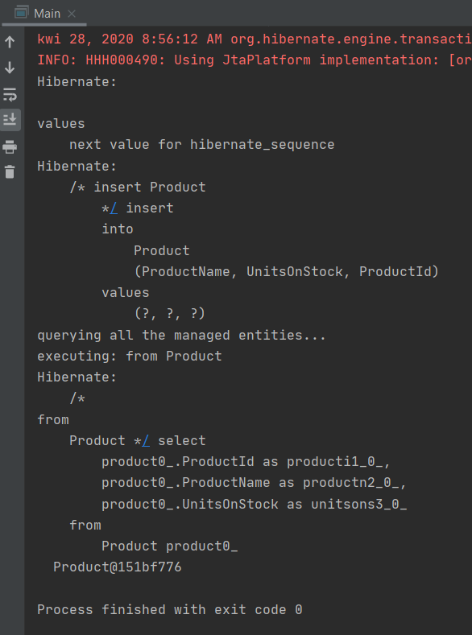

Schemat w bazie danych wygląda następująco:

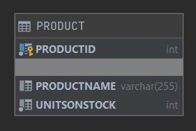

Skrypt tworzący tabelę `Product`:

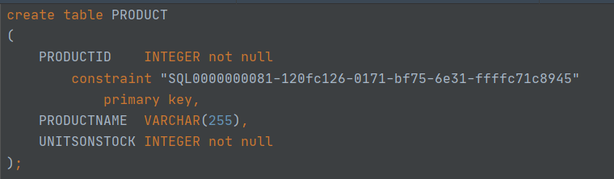
 
 Jak widać produkt dodał się poprawnie:

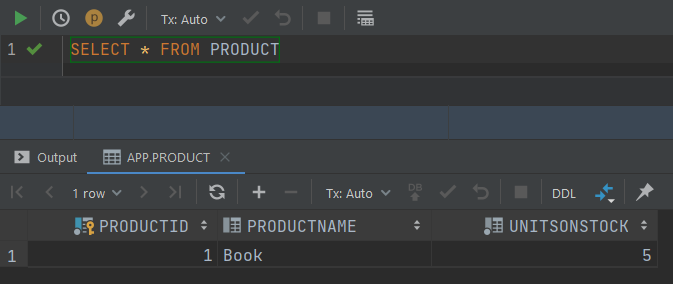

### IV. Klasa Supplier

Zmodyfikowano model wprowadzając pojęcie dostawcy jak poniżej.

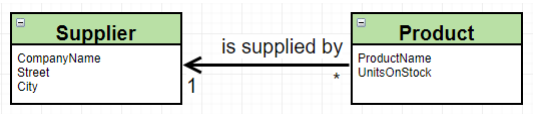

Klasa `Supplier` zawiera pola:
* public int SupplierId
* public String CompanyName
* public String Street
* public String City

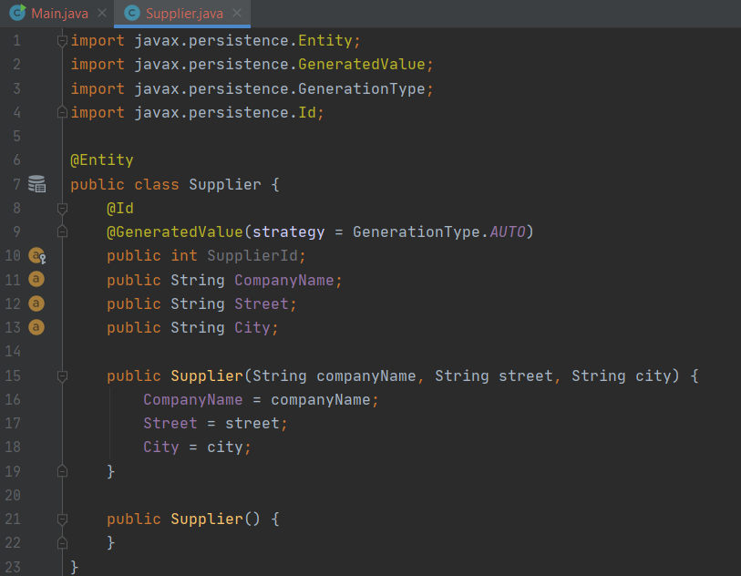

Zmodyfikowano klasę `Product`, dodając do niej pole `Supplier` i funkcję `setSupplier(Supplier supplier)` przypisującą danego dostawcę do produktu.

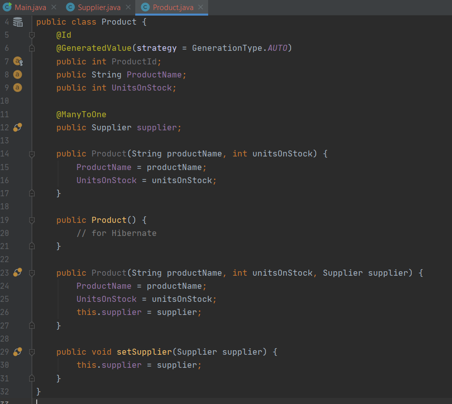

Utworzono nowego dostawcę i przypisano go do wcześniej dodanego produktu.

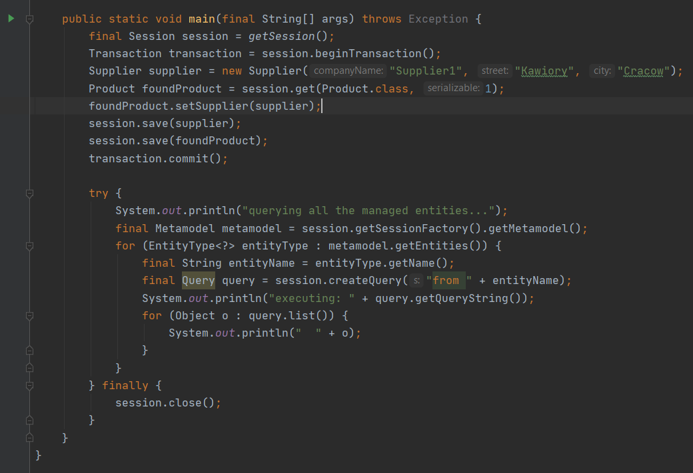

Schemat bazy danych wygląda następująco:

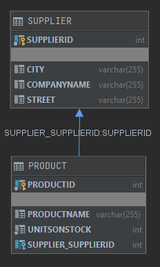

Jak widać dane dodały się poprawnie.

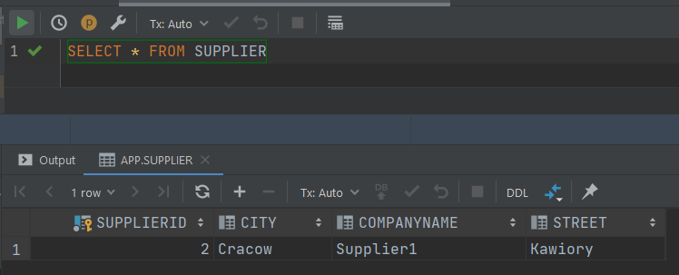

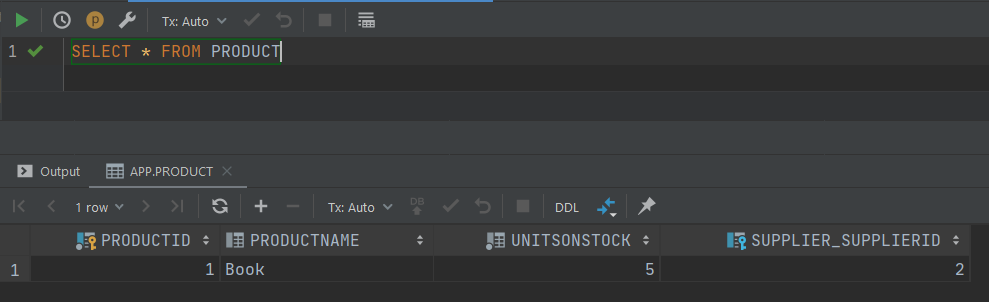

### V. Odwrócona relacja Supplier - Product

Odwrócono relację zgodnie z poniższym schematem.

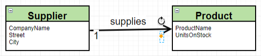

#### a) Wariant z tabelą łącznikową

Usunięto z klasy `Product` wcześniej dodane pole `Supplier`.

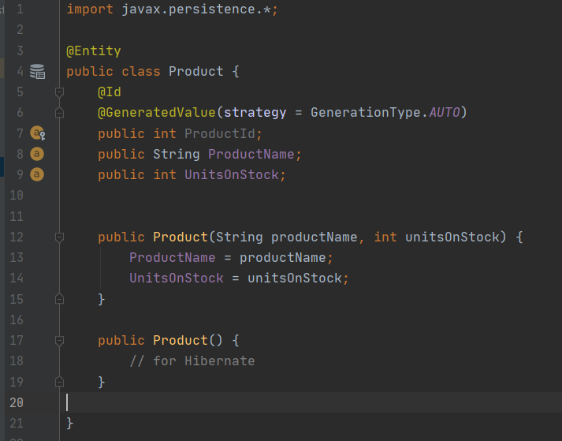

Do klasy `Supplier` dodano zbiór produktów i metodę `addProduct(Product product)` dodającą dany produkt do zbioru produktów dostarczanych przez danego dostawcę.

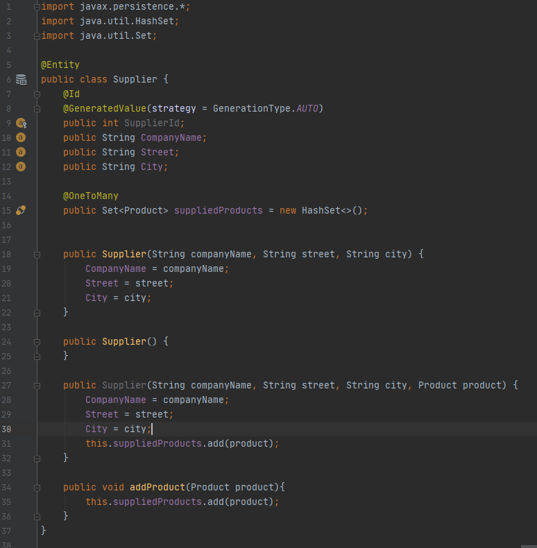

Dodano kilka produktów i dostawcę, a następnie przypisano utworzone produkty do zbioru produktów dostarczanych przez dostawcę.

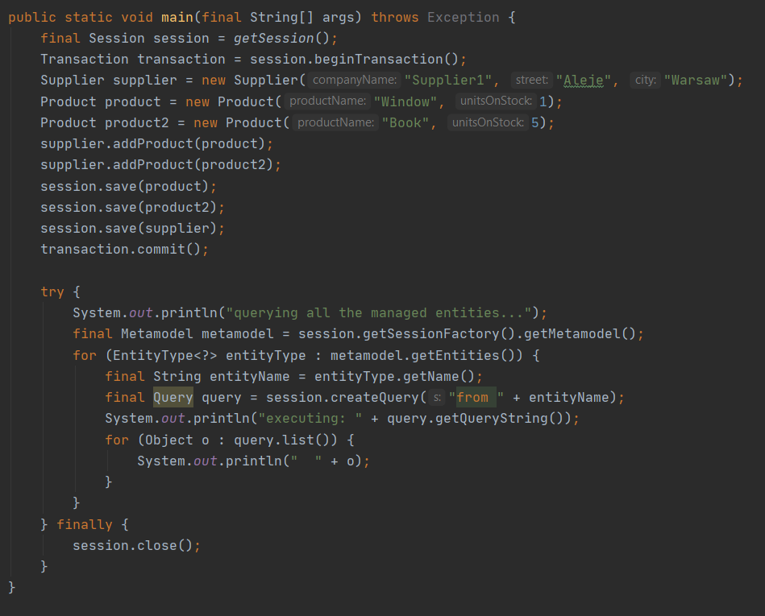

Schemat bazy danych wygląda następująco:

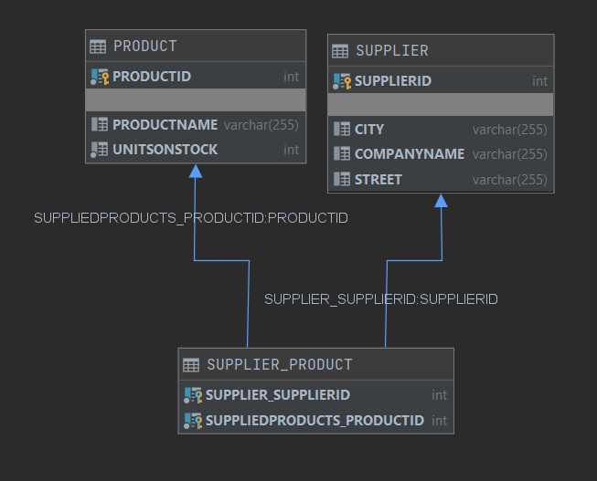

Jak widać powyżej, dodała się tabela łącznikowa `SUPPLIER_PRODUCT`.

Dodane dane:

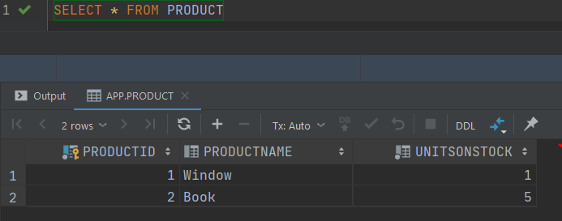

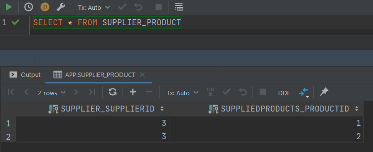

#### b) Wariant bez tabeli łącznikowej

W klasie `Supplier` nad zbiorem produktów dopisano *@JoinColumn(name="Supplier_FK")*.

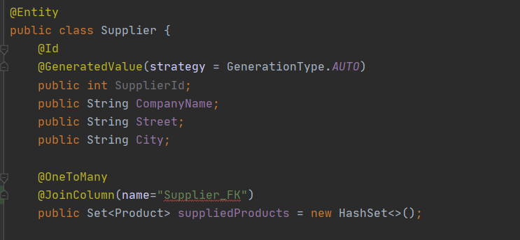

Schemat bazy danych wygląda jak poniżej.

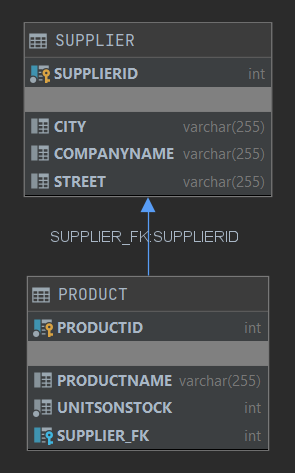

Jak widać nie dodała się tabela łącznikowa. Zamiast niej w tabeli `Product` jest pole `SUPPLIER_FK`.

Skrypt generujący tabele:

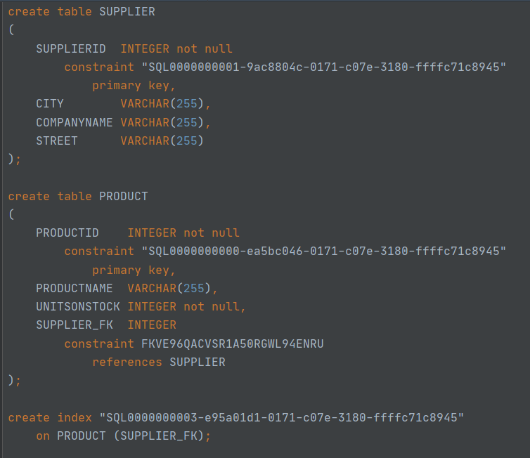

Dane dodane do bazy:

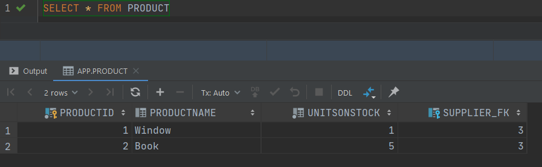

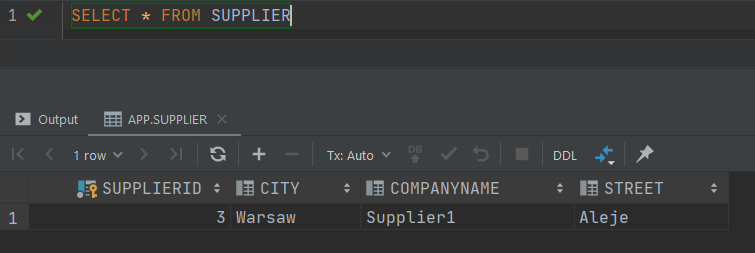