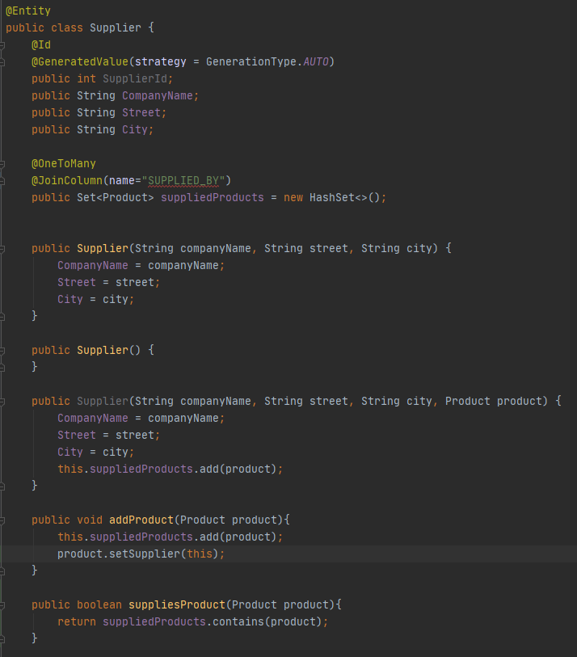
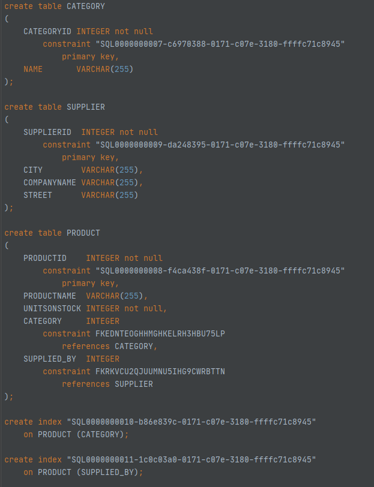
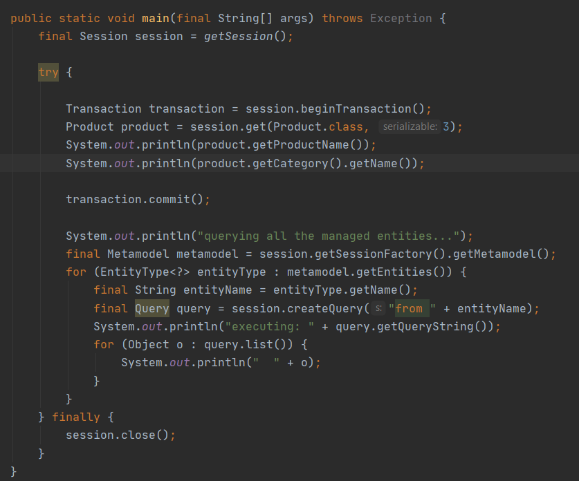

# Hibernate
## Aleksandra Mazur

### Zadanie II. Basics
#### a) - h) Konfiguracja
Uruchomiono i podpięto się do serwera *Derby* oraz założono bazę `AMazurJPA`.

Polecenie *show tables* zwróciło poniższe dane.


#### i) Projekt Javowy
Utworzono projekt w Intellij o nazwie `AMazurJPAPractice`.

#### j), k) Klasa Product
Stworzono klasę `Product` z polami:
* public int ProductId
* public String ProductName
* public int UnitsOnStock

Uzupełniono w klasie elementy potrzebne do zmapowania jej do bazy danych.


#### l), m) Hibernate config
W pliku `hibernate.cfg.xml` uzupełniono potrzebne property.


### Zadanie III. Dodanie produktu

W klasie `Main` stworzono przykładowy produkt i zapisano go do bazy danych.


Schemat w bazie danych wygląda następująco:


Skrypt tworzący tabelę `Product`:


 
 Jak widać produkt dodał się poprawnie:


### Zadanie IV. Klasa Supplier

Zmodyfikowano model wprowadzając pojęcie dostawcy jak poniżej.


Klasa `Supplier` zawiera pola:
* public int SupplierId
* public String CompanyName
* public String Street
* public String City


Zmodyfikowano klasę `Product`, dodając do niej pole `Supplier` i funkcję `setSupplier(Supplier supplier)` przypisującą danego dostawcę do produktu.


Do pliku `hibernate.cfg.xml` dodano Suppliera.


Utworzono nowego dostawcę i przypisano go do wcześniej dodanego produktu.


Schemat bazy danych wygląda następująco:


Jak widać dane dodały się poprawnie.


### Zadanie V. Odwrócona relacja Supplier - Product

Odwrócono relację zgodnie z poniższym schematem.


#### a) Wariant z tabelą łącznikową

Usunięto z klasy `Product` wcześniej dodane pole `Supplier`.


Do klasy `Supplier` dodano zbiór produktów i metodę `addProduct(Product product)` dodającą dany produkt do zbioru produktów dostarczanych przez danego dostawcę.


Dodano kilka produktów i dostawcę, a następnie przypisano utworzone produkty do zbioru produktów dostarczanych przez dostawcę.


Schemat bazy danych wygląda następująco:


Jak widać powyżej, dodała się tabela łącznikowa `SUPPLIER_PRODUCT`.

Dodane dane:


#### b) Wariant bez tabeli łącznikowej

W klasie `Supplier` nad zbiorem produktów dopisano *@JoinColumn(name="Supplier_FK")*.


Schemat bazy danych wygląda jak poniżej.


Jak widać nie dodała się tabela łącznikowa. Zamiast niej w tabeli `Product` jest pole `SUPPLIER_FK`.

Skrypt generujący tabele:


Dane dodane do bazy:


### Zadanie VI. Relacja dwustronna
Zamodelowano relację dwustronną jak poniżej.


Metody dodane/zmodyfikowane w klasie `Supplier`:
* `suppliesProduct(Product product)` zwracającą prawdę, jeżeli dostawca ma dany produkt w zbiorze dostarczanych produktów i fałsz w przeciwnym przypadku.
* `addProduct(Product product)` dodającą produkt do zbioru dostarczanych produktów i przypisującą dostawcę produktowi



Klasa `Product`:
Dodano do klasy pole `Supplier` i metodę `setSupplier(Supplier supplier)` przypisującą dostawcę do produktu oraz dodającą produkt do zbioru produktów dostarczanych przez dostawcę, jeżeli nie należy on jeszcze do tego zbioru.


Schemat bazy danych wygląda następująco.


Skrypt tworzący tabele:


Dodane dane:


### Zadanie VII. Klasa Category
#### a) Modyfikacja modelu
Dodano klasę `Category` z polami:
* private int CategoryId
* private String Name
* private List <\Product> Products

Klasa ta posiada metodę `addProduct(Product product)`, która dodaje dany produkt do listy produktów bieżącej kategorii oraz przypisuje kategorię produktowi.


Do pliku `hibernate.cfg.xml` dodano Category.


Zmodyfikowano klasę `Product`, dodając wskazanie na kategorię, do której należy oraz metodę `setCategory(Category category)` przypisującą daną kategorię produktowi i dodającą produkt do listy produktów kategorii, jeśli jeszcze nie został tam dodany. Co więcej zmieniono dostępność atrybutów we wszystkich klasach na prywatne.


Schemat bazy wygląda następująco:


Skrypt generujący tabele:



#### b), c) Dodanie danych

W `Mainie` dodano dostawcę, kilka produktów i kategorii jak poniżej.


Po uruchomieniu powyższego kodu baza danych wygląda następująco:


#### d) Wyciągnięcie danych z bazy

* Produkty z wybranej kategorii:


* Kategoria, do której należy wybrany produkt:




### Zadanie VIII. Klasa Invoice (relacje wiele-do wielu)
#### a) Modyfikacja modelu
Zamodelowano relację wiele-do-wielu jak poniżej.


Stworzono klasę `Invoice` o atrybutach:
* private int InvoiceNumber
* private int Quantity
* private Set \<Product> includesProducts

Dodano do niej między innymi metodę `addProduct(Product product)`, dodającą produkt do zbioru produktów faktury i zwiększającą ilość produktów na fakturze o 1.


Do klasy `Product` dodano zbiór faktur, które zawierają bieżący produkt:
* private Set\<Invoice> canBeSoldIn


Do pliku `hibernate.cfg.xml` dodano Invoice.


Schemat bazy dancyh wygląda następująco:


Skrypt generujący bazę danych:

```sql
create table CATEGORY
(
    CATEGORYID INTEGER not null
        constraint "SQL0000000007-c6970388-0171-c07e-3180-ffffc71c8945"
            primary key,
    NAME       VARCHAR(255)
);

create table INVOICE
(
    INVOICENUMBER INTEGER not null
        constraint "SQL0000000012-5d5b4477-0171-c07e-3180-ffffc71c8945"
            primary key,
    QUANTITY      INTEGER not null
);

create table SUPPLIER
(
    SUPPLIERID  INTEGER not null
        constraint "SQL0000000009-da248395-0171-c07e-3180-ffffc71c8945"
            primary key,
    CITY        VARCHAR(255),
    COMPANYNAME VARCHAR(255),
    STREET      VARCHAR(255)
);

create table PRODUCT
(
    PRODUCTID    INTEGER not null
        constraint "SQL0000000008-f4ca438f-0171-c07e-3180-ffffc71c8945"
            primary key,
    PRODUCTNAME  VARCHAR(255),
    UNITSONSTOCK INTEGER not null,
    CATEGORY     INTEGER
        constraint FKEDNTEOGHHMGHKELRH3HBU75LP
            references CATEGORY,
    SUPPLIED_BY  INTEGER
        constraint FKRKVCU2QJUUMNU5IHG9CWRBTTN
            references SUPPLIER
);

create table INVOICE_PRODUCT
(
    CANBESOLDIN_INVOICENUMBER  INTEGER not null
        constraint FK3MT734UUBMOS8GVSXV85H0XXJ
            references INVOICE,
    INCLUDESPRODUCTS_PRODUCTID INTEGER not null
        constraint FKBX01IKXFWEBN63V0K8F4L2EDL
            references PRODUCT,
    constraint "SQL0000000013-ad30c47e-0171-c07e-3180-ffffc71c8945"
        primary key (CANBESOLDIN_INVOICENUMBER, INCLUDESPRODUCTS_PRODUCTID)
);

create index "SQL0000000014-cd128485-0171-c07e-3180-ffffc71c8945"
    on INVOICE_PRODUCT (INCLUDESPRODUCTS_PRODUCTID);

create index "SQL0000000015-dabb448a-0171-c07e-3180-ffffc71c8945"
    on INVOICE_PRODUCT (CANBESOLDIN_INVOICENUMBER);

create index "SQL0000000010-b86e839c-0171-c07e-3180-ffffc71c8945"
    on PRODUCT (CATEGORY);

create index "SQL0000000011-1c0c03a0-0171-c07e-3180-ffffc71c8945"
    on PRODUCT (SUPPLIED_BY);
```

#### Dodanie obiektów do bazy

Dodano kilka produktów, faktur, dostawcę i kategorię.


Zawartość bazy danych po uruchomieniu powyższego kodu:


#### b) Wypisanie produktów sprzedanych w ramch wybranej faktury


#### c) Wypisanie faktur w ramach, których był sprzedany wybrany produkt


