# Hibernate, JPA
## Aleksandra Mazur

### Zadanie II. Basics
#### a) - h) Konfiguracja
Uruchomiono i podpięto się do serwera *Derby* oraz założono bazę `AMazurJPA`.

Polecenie *show tables* zwróciło poniższe dane.


<div style="page-break-after: always;"></div>

#### i) Projekt Javowy
Utworzono projekt w Intellij o nazwie `AMazurJPAPractice`.

#### j), k) Klasa Product
Stworzono klasę `Product` z polami:
* public int ProductId
* public String ProductName
* public int UnitsOnStock

Uzupełniono w klasie elementy potrzebne do zmapowania jej do bazy danych.


<div style="page-break-after: always;"></div>

#### l), m) Hibernate config
W pliku `hibernate.cfg.xml` uzupełniono potrzebne property.


<div style="page-break-after: always;"></div>

### Zadanie III. Dodanie produktu

W klasie `Main` stworzono przykładowy produkt i zapisano go do bazy danych.


<div style="page-break-after: always;"></div>

Schemat w bazie danych wygląda następująco:


Skrypt tworzący tabelę `Product`:


 
 Jak widać produkt dodał się poprawnie:


<div style="page-break-after: always;"></div>

### Zadanie IV. Klasa Supplier

Zmodyfikowano model wprowadzając pojęcie dostawcy jak poniżej.


Klasa `Supplier` zawiera pola:
* public int SupplierId
* public String CompanyName
* public String Street
* public String City


<div style="page-break-after: always;"></div>

Zmodyfikowano klasę `Product`, dodając do niej pole `Supplier` i funkcję `setSupplier(Supplier supplier)` przypisującą danego dostawcę do produktu.


<div style="page-break-after: always;"></div>

Do pliku `hibernate.cfg.xml` dodano Suppliera.

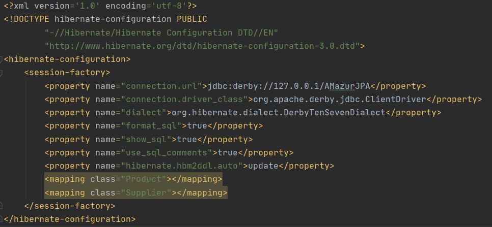

Utworzono nowego dostawcę i przypisano go do wcześniej dodanego produktu.


<div style="page-break-after: always;"></div>

Schemat bazy danych wygląda następująco:


Jak widać dane dodały się poprawnie.


<div style="page-break-after: always;"></div>

### Zadanie V. Odwrócona relacja Supplier - Product

Odwrócono relację zgodnie z poniższym schematem.


#### a) Wariant z tabelą łącznikową

Usunięto z klasy `Product` wcześniej dodane pole `Supplier`.


<div style="page-break-after: always;"></div>

Do klasy `Supplier` dodano zbiór produktów i metodę `addProduct(Product product)` dodającą dany produkt do zbioru produktów dostarczanych przez danego dostawcę.


<div style="page-break-after: always;"></div>

Dodano kilka produktów i dostawcę, a następnie przypisano utworzone produkty do zbioru produktów dostarczanych przez dostawcę.


<div style="page-break-after: always;"></div>

Schemat bazy danych wygląda następująco:


Jak widać powyżej, dodała się tabela łącznikowa `SUPPLIER_PRODUCT`.

Dodane dane:

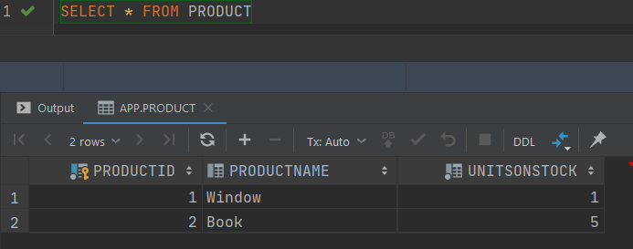

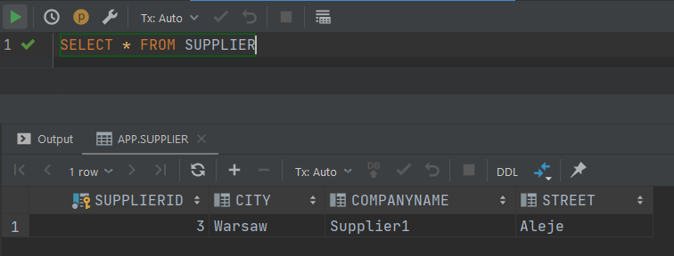


#### b) Wariant bez tabeli łącznikowej

W klasie `Supplier` nad zbiorem produktów dopisano *@JoinColumn(name="Supplier_FK")*.

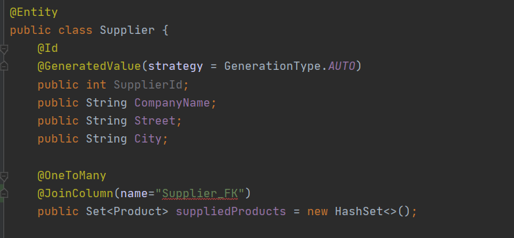

<div style="page-break-after: always;"></div>

Schemat bazy danych wygląda jak poniżej.


Jak widać nie dodała się tabela łącznikowa. Zamiast niej w tabeli `Product` jest pole `SUPPLIER_FK`.

<div style="page-break-after: always;"></div>

Skrypt generujący tabele:


Dane dodane do bazy:


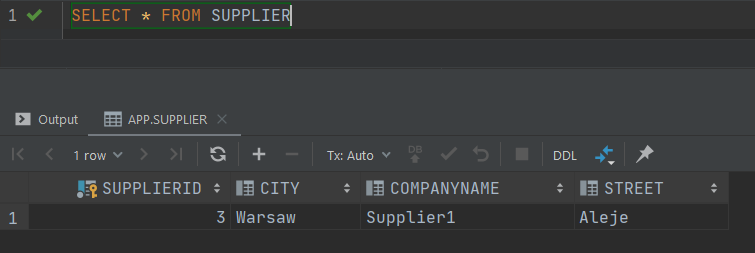

<div style="page-break-after: always;"></div>

### Zadanie VI. Relacja dwustronna
Zamodelowano relację dwustronną jak poniżej.

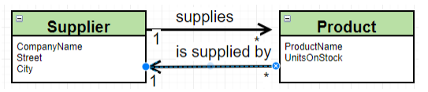

Metody dodane/zmodyfikowane w klasie `Supplier`:
* `suppliesProduct(Product product)` zwracająca prawdę, jeżeli dostawca ma dany produkt w zbiorze dostarczanych produktów i fałsz w przeciwnym przypadku.
* `addProduct(Product product)` dodająca produkt do zbioru dostarczanych produktów i przypisująca dostawcę produktowi


<div style="page-break-after: always;"></div>

Klasa `Product`:

Dodano do klasy pole `Supplier` i metodę `setSupplier(Supplier supplier)` przypisującą dostawcę do produktu oraz dodającą produkt do zbioru produktów dostarczanych przez dostawcę, jeżeli nie należy on jeszcze do tego zbioru.


<div style="page-break-after: always;"></div>

Schemat bazy danych wygląda następująco.


Skrypt tworzący tabele:


<div style="page-break-after: always;"></div>

Dodane dane:

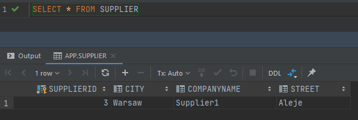


<div style="page-break-after: always;"></div>

### Zadanie VII. Klasa Category
#### a) Modyfikacja modelu
Dodano klasę `Category` z polami:
* private int CategoryId
* private String Name
* private List \<Product> Products

Klasa ta posiada metodę `addProduct(Product product)`, która dodaje dany produkt do listy produktów bieżącej kategorii oraz przypisuje kategorię produktowi.


<div style="page-break-after: always;"></div>

Do pliku `hibernate.cfg.xml` dodano Category.


<div style="page-break-after: always;"></div>

Zmodyfikowano klasę `Product`, dodając wskazanie na kategorię, do której należy oraz metodę `setCategory(Category category)`, przypisującą daną kategorię produktowi i dodającą produkt do listy produktów kategorii, jeśli jeszcze nie został tam dodany. Zmieniono również dostępność atrybutów we wszystkich klasach na prywatne.

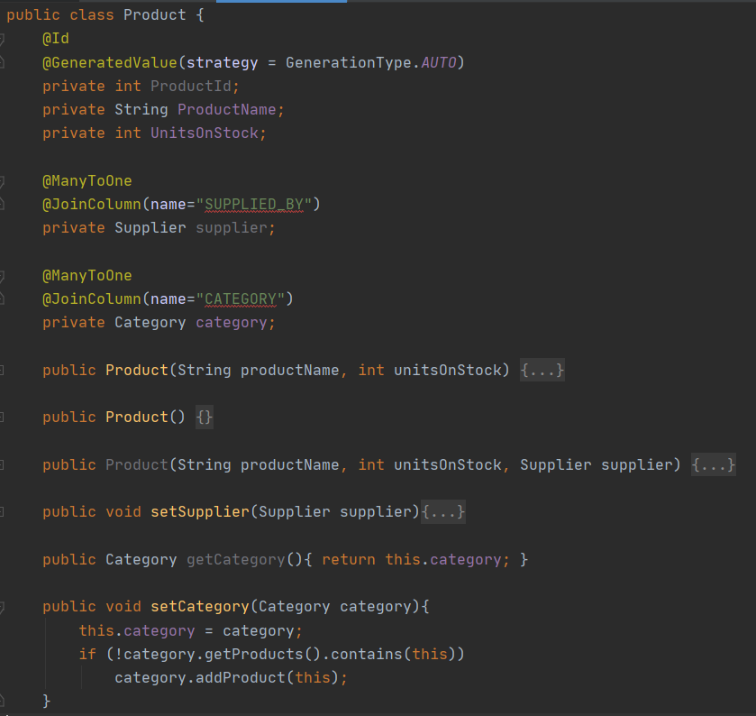

<div style="page-break-after: always;"></div>

Schemat bazy wygląda następująco:


<div style="page-break-after: always;"></div>

Skrypt generujący tabele:


<div style="page-break-after: always;"></div>

#### b), c) Dodanie danych

W `Mainie` dodano dostawcę, kilka produktów i kategorii jak poniżej.


<div style="page-break-after: always;"></div>

Po uruchomieniu powyższego kodu baza danych wygląda następująco:


<div style="page-break-after: always;"></div>

#### d) Wyciągnięcie danych z bazy

* Produkty z wybranej kategorii:


<div style="page-break-after: always;"></div>

* Kategoria, do której należy wybrany produkt:


<div style="page-break-after: always;"></div>

### Zadanie VIII. Klasa Invoice (relacje wiele-do wielu)
#### a) Modyfikacja modelu
Zamodelowano relację wiele-do-wielu jak poniżej.

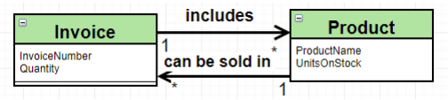

Stworzono klasę `Invoice` o atrybutach:
* private int InvoiceNumber
* private int Quantity
* private Set \<Product> includesProducts

Dodano do niej między innymi metodę `addProduct(Product product)`, dodającą produkt do zbioru produktów faktury, fakturę do zbioru faktur danego produktu i zwiększającą ilość produktów na fakturze o 1.


<div style="page-break-after: always;"></div>

Do klasy `Product` dodano zbiór faktur, które zawierają bieżący produkt:
* private Set\<Invoice> canBeSoldIn


Do pliku `hibernate.cfg.xml` dodano Invoice.


<div style="page-break-after: always;"></div>

Schemat bazy dancyh wygląda następująco:

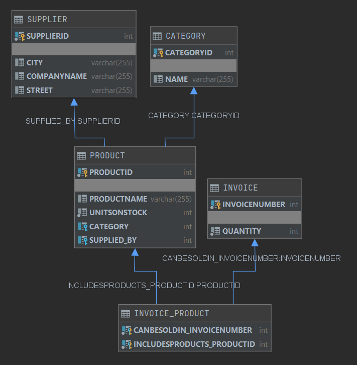

<div style="page-break-after: always;"></div>

Skrypt generujący bazę danych:

```sql
create table CATEGORY
(
    CATEGORYID INTEGER not null
        constraint "SQL0000000018-cccb420a-0171-c670-619d-ffffc71c8945"
            primary key,
    NAME       VARCHAR(255)
);

create table INVOICE
(
    INVOICENUMBER INTEGER not null
        constraint "SQL0000000019-7fde0210-0171-c670-619d-ffffc71c8945"
            primary key,
    QUANTITY      INTEGER not null
);

create table SUPPLIER
(
    SUPPLIERID  INTEGER not null
        constraint "SQL0000000022-194c4222-0171-c670-619d-ffffc71c8945"
            primary key,
    CITY        VARCHAR(255),
    COMPANYNAME VARCHAR(255),
    STREET      VARCHAR(255)
);

create table PRODUCT
(
    PRODUCTID    INTEGER not null
        constraint "SQL0000000021-a61e821c-0171-c670-619d-ffffc71c8945"
            primary key,
    PRODUCTNAME  VARCHAR(255),
    UNITSONSTOCK INTEGER not null,
    CATEGORY     INTEGER
        constraint FKEDNTEOGHHMGHKELRH3HBU75LP
            references CATEGORY (CATEGORYID),
    SUPPLIED_BY  INTEGER
        constraint FKRKVCU2QJUUMNU5IHG9CWRBTTN
            references SUPPLIER (SUPPLIERID)
);

create table INVOICE_PRODUCT
(
    CANBESOLDIN_INVOICENUMBER  INTEGER not null
        constraint FK3MT734UUBMOS8GVSXV85H0XXJ
            references INVOICE (INVOICENUMBER),
    INCLUDESPRODUCTS_PRODUCTID INTEGER not null
        constraint FKBX01IKXFWEBN63V0K8F4L2EDL
            references PRODUCT (PRODUCTID),
    constraint "SQL0000000020-f2f9c216-0171-c670-619d-ffffc71c8945"
        primary key (CANBESOLDIN_INVOICENUMBER, INCLUDESPRODUCTS_PRODUCTID)
);

create index "SQL0000000023-cc830228-0171-c670-619d-ffffc71c8945"
    on INVOICE_PRODUCT (INCLUDESPRODUCTS_PRODUCTID);

create index "SQL0000000024-2eac822c-0171-c670-619d-ffffc71c8945"
    on INVOICE_PRODUCT (CANBESOLDIN_INVOICENUMBER);

create index "SQL0000000025-90da0230-0171-c670-619d-ffffc71c8945"
    on PRODUCT (CATEGORY);

create index "SQL0000000026-f30b8234-0171-c670-619d-ffffc71c8945"
    on PRODUCT (SUPPLIED_BY);
```

#### Dodanie obiektów do bazy

Dodano kilka produktów, faktur, dostawcę i kategorię.


<div style="page-break-after: always;"></div>

Zawartość bazy danych po uruchomieniu powyższego kodu:

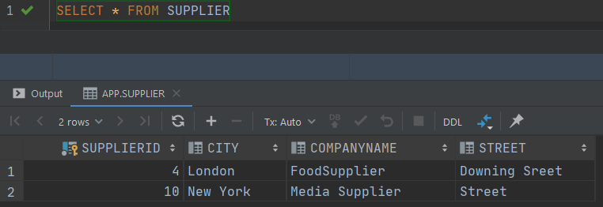


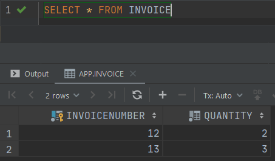


<div style="page-break-after: always;"></div>

#### b) Wypisanie produktów sprzedanych w ramach wybranej faktury


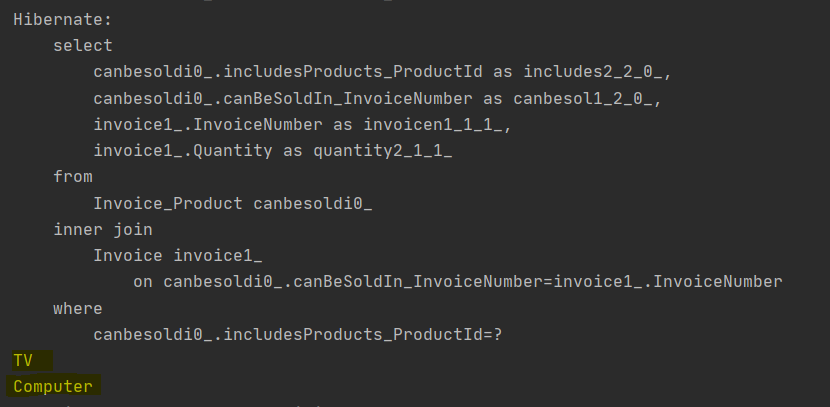

<div style="page-break-after: always;"></div>

#### c) Wypisanie faktur w ramach, których był sprzedany wybrany produkt

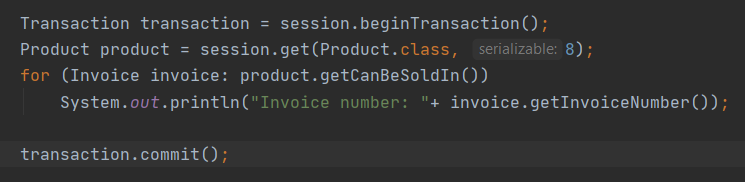


<div style="page-break-after: always;"></div>

### Zadanie IX-X. JPA

Stworzono plik `persistence.xml` w folderze `META-INF` oraz nowego maina `JPAMain` jak poniżej:


Dodano do bazy dostawcę i kilka produktów.

<div style="page-break-after: always;"></div>

Schemat bazy wygląda następująco:


<div style="page-break-after: always;"></div>

Skrypt generujący bazę:

```sql
create table CATEGORY
(
    CATEGORYID INTEGER not null
        constraint "SQL0000000000-d7bd80dd-0171-c670-619d-ffffc71c8945"
            primary key,
    NAME       VARCHAR(255)
);

create table INVOICE
(
    INVOICENUMBER INTEGER not null
        constraint "SQL0000000001-f14580e4-0171-c670-619d-ffffc71c8945"
            primary key,
    QUANTITY      INTEGER not null
);

create table SUPPLIER
(
    SUPPLIERID  INTEGER not null
        constraint "SQL0000000004-1e2700f9-0171-c670-619d-ffffc71c8945"
            primary key,
    CITY        VARCHAR(255),
    COMPANYNAME VARCHAR(255),
    STREET      VARCHAR(255)
);

create table PRODUCT
(
    PRODUCTID    INTEGER not null
        constraint "SQL0000000003-247a40f2-0171-c670-619d-ffffc71c8945"
            primary key,
    PRODUCTNAME  VARCHAR(255),
    UNITSONSTOCK INTEGER not null,
    CATEGORY     INTEGER
        constraint FKEDNTEOGHHMGHKELRH3HBU75LP
            references CATEGORY (CATEGORYID),
    SUPPLIED_BY  INTEGER
        constraint FKRKVCU2QJUUMNU5IHG9CWRBTTN
            references SUPPLIER (SUPPLIERID)
);

create table INVOICE_PRODUCT
(
    CANBESOLDIN_INVOICENUMBER  INTEGER not null
        constraint FK3MT734UUBMOS8GVSXV85H0XXJ
            references INVOICE (INVOICENUMBER),
    INCLUDESPRODUCTS_PRODUCTID INTEGER not null
        constraint FKBX01IKXFWEBN63V0K8F4L2EDL
            references PRODUCT (PRODUCTID),
    constraint "SQL0000000002-3ad9c0eb-0171-c670-619d-ffffc71c8945"
        primary key (CANBESOLDIN_INVOICENUMBER, INCLUDESPRODUCTS_PRODUCTID)
);

create index "SQL0000000005-97e00100-0171-c670-619d-ffffc71c8945"
    on INVOICE_PRODUCT (INCLUDESPRODUCTS_PRODUCTID);

create index "SQL0000000006-61228105-0171-c670-619d-ffffc71c8945"
    on INVOICE_PRODUCT (CANBESOLDIN_INVOICENUMBER);

create index "SQL0000000007-6a6b410a-0171-c670-619d-ffffc71c8945"
    on PRODUCT (CATEGORY);

create index "SQL0000000008-83ba410f-0171-c670-619d-ffffc71c8945"
    on PRODUCT (SUPPLIED_BY);
```

Obiekty dodane do bazy:


<div style="page-break-after: always;"></div>

### Zadanie XI. Kaskady

Zmodyfikowano model w taki sposób, aby było możliwe kaskadowe tworzenie faktur wraz z nowymi produktami oraz produktów wraz z nową fakturą.

W klasie `Product` zbiór faktur wygląda następująco:

```java
@ManyToMany(mappedBy = "includesProducts", fetch = FetchType.EAGER, cascade = CascadeType.PERSIST)
private Set<Invoice> canBeSoldIn = new HashSet<>();
```

W klasie `Invoice` zbiór produktów:
```java
@ManyToMany(cascade = CascadeType.PERSIST)
private Set<Product> includesProducts = new HashSet<>();
```

W klasie `JPAMain` stworzono kilka produktów, kategorię, dostawcę i faktury i dodano wszystkie rzeczy oprócz produktów do bazy.

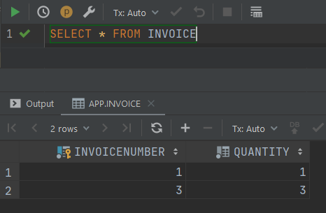


Wszystkie obiekty (łącznie z produktami) dodały się prawidłowo do bazy.

<div style="page-break-after: always;"></div>

Spróbowano również dodać wszystkie obiekty oprócz faktur jak poniżej.


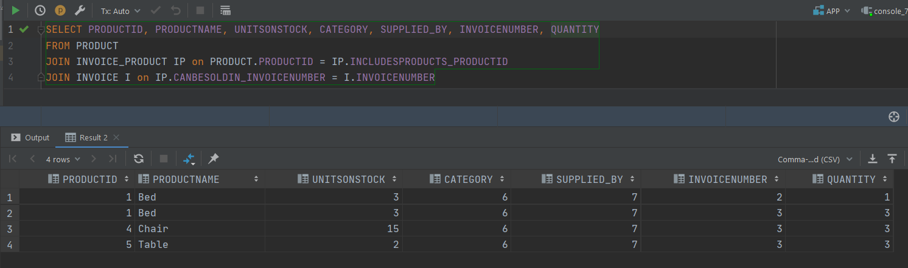

Obiekty (łącznie z fakturami) również dodały się prawidłowo. Kaskadowość zatem działa.

<div style="page-break-after: always;"></div>

### Zadanie XII. Embedded class

#### a), b) Modyfikacja modelu
Dodano do modelu nową klasę `Address` i "wbudowano" ją do tabeli dostawców.

Klasa ta zawiera następujące pola:
* private String country
* private String city
* private String street
* private String zipCode


<div style="page-break-after: always;"></div>

W klasie `Supplier` pola `City` i `Street` zastąpiono polem `Address`:


Dodano do bazy kilku dostawców:


<div style="page-break-after: always;"></div>

Schemat bazy danych wygląda następująco:


<div style="page-break-after: always;"></div>

Skrypt generujący bazę danych:

```sql
create table CATEGORY
(
    CATEGORYID INTEGER not null
        constraint "SQL0000000054-5abe851c-0171-c670-619d-ffffc71c8945"
            primary key,
    NAME       VARCHAR(255)
);

create table INVOICE
(
    INVOICENUMBER INTEGER not null
        constraint "SQL0000000055-d26c4522-0171-c670-619d-ffffc71c8945"
            primary key,
    QUANTITY      INTEGER not null
);

create table SUPPLIER
(
    SUPPLIERID  INTEGER not null
        constraint "SQL0000000058-a2f88535-0171-c670-619d-ffffc71c8945"
            primary key,
    COMPANYNAME VARCHAR(255),
    CITY        VARCHAR(255),
    COUNTRY     VARCHAR(255),
    STREET      VARCHAR(255),
    ZIPCODE     VARCHAR(255)
);

create table PRODUCT
(
    PRODUCTID    INTEGER not null
        constraint "SQL0000000057-01e2c52e-0171-c670-619d-ffffc71c8945"
            primary key,
    PRODUCTNAME  VARCHAR(255),
    UNITSONSTOCK INTEGER not null,
    CATEGORY     INTEGER
        constraint FKEDNTEOGHHMGHKELRH3HBU75LP
            references CATEGORY (CATEGORYID),
    SUPPLIED_BY  INTEGER
        constraint FKRKVCU2QJUUMNU5IHG9CWRBTTN
            references SUPPLIER (SUPPLIERID)
);

create table INVOICE_PRODUCT
(
    CANBESOLDIN_INVOICENUMBER  INTEGER not null
        constraint FK3MT734UUBMOS8GVSXV85H0XXJ
            references INVOICE (INVOICENUMBER),
    INCLUDESPRODUCTS_PRODUCTID INTEGER not null
        constraint FKBX01IKXFWEBN63V0K8F4L2EDL
            references PRODUCT (PRODUCTID),
    constraint "SQL0000000056-8a230528-0171-c670-619d-ffffc71c8945"
        primary key (CANBESOLDIN_INVOICENUMBER, INCLUDESPRODUCTS_PRODUCTID)
);

create index "SQL0000000059-8acbc53b-0171-c670-619d-ffffc71c8945"
    on INVOICE_PRODUCT (INCLUDESPRODUCTS_PRODUCTID);

create index "SQL0000000060-d008453f-0171-c670-619d-ffffc71c8945"
    on INVOICE_PRODUCT (CANBESOLDIN_INVOICENUMBER);

create index "SQL0000000061-1548c543-0171-c670-619d-ffffc71c8945"
    on PRODUCT (CATEGORY);

create index "SQL0000000062-5a8d4547-0171-c670-619d-ffffc71c8945"
    on PRODUCT (SUPPLIED_BY);
```

Dane dodały się poprawnie:


<div style="page-break-after: always;"></div>

#### c), d) Modyfikacja modelu

Zmodyfikowano model w taki sposób, aby dane adresowe znajdowały się w klasie dostawców. Zmapowano to do dwóch osobnych tabel.

Klasa `Supplier`:


Dodano kilku dostawców:


<div style="page-break-after: always;"></div>

Schemat bazy danych:


<div style="page-break-after: always;"></div>

Skrypt generujący bazę:

```sql
create table CATEGORY
(
    CATEGORYID INTEGER not null
        constraint "SQL0000000075-791dc68b-0171-c670-619d-ffffc71c8945"
            primary key,
    NAME       VARCHAR(255)
);

create table INVOICE
(
    INVOICENUMBER INTEGER not null
        constraint "SQL0000000076-e2f20691-0171-c670-619d-ffffc71c8945"
            primary key,
    QUANTITY      INTEGER not null
);

create table SUPPLIER
(
    SUPPLIERID  INTEGER not null
        constraint "SQL0000000079-20a4c6a3-0171-c670-619d-ffffc71c8945"
            primary key,
    COMPANYNAME VARCHAR(255)
);

create table ADDRESS
(
    CITY       VARCHAR(255),
    COUNTRY    VARCHAR(255),
    STREET     VARCHAR(255),
    ZIPCODE    VARCHAR(255),
    SUPPLIERID INTEGER not null
        constraint "SQL0000000074-8f528685-0171-c670-619d-ffffc71c8945"
            primary key
        constraint FKFIXSMY956R97J539UD6866JN5
            references SUPPLIER (SUPPLIERID)
);

create index "SQL0000000080-8a9d06a9-0171-c670-619d-ffffc71c8945"
    on ADDRESS (SUPPLIERID);

create table PRODUCT
(
    PRODUCTID    INTEGER not null
        constraint "SQL0000000078-36b5869d-0171-c670-619d-ffffc71c8945"
            primary key,
    PRODUCTNAME  VARCHAR(255),
    UNITSONSTOCK INTEGER not null,
    CATEGORY     INTEGER
        constraint FKEDNTEOGHHMGHKELRH3HBU75LP
            references CATEGORY (CATEGORYID),
    SUPPLIED_BY  INTEGER
        constraint FKRKVCU2QJUUMNU5IHG9CWRBTTN
            references SUPPLIER (SUPPLIERID)
);

create table INVOICE_PRODUCT
(
    CANBESOLDIN_INVOICENUMBER  INTEGER not null
        constraint FK3MT734UUBMOS8GVSXV85H0XXJ
            references INVOICE (INVOICENUMBER),
    INCLUDESPRODUCTS_PRODUCTID INTEGER not null
        constraint FKBX01IKXFWEBN63V0K8F4L2EDL
            references PRODUCT (PRODUCTID),
    constraint "SQL0000000077-4ccf4697-0171-c670-619d-ffffc71c8945"
        primary key (CANBESOLDIN_INVOICENUMBER, INCLUDESPRODUCTS_PRODUCTID)
);

create index "SQL0000000081-3af2c6ae-0171-c670-619d-ffffc71c8945"
    on INVOICE_PRODUCT (INCLUDESPRODUCTS_PRODUCTID);

create index "SQL0000000082-a1a246b2-0171-c670-619d-ffffc71c8945"
    on INVOICE_PRODUCT (CANBESOLDIN_INVOICENUMBER);

create index "SQL0000000083-0855c6b6-0171-c670-619d-ffffc71c8945"
    on PRODUCT (CATEGORY);

create index "SQL0000000084-6f0d46ba-0171-c670-619d-ffffc71c8945"
    on PRODUCT (SUPPLIED_BY);
```

Obiekty dodane do bazy:


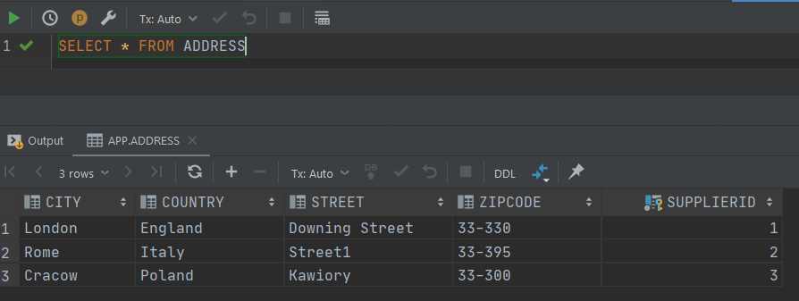

<div style="page-break-after: always;"></div>

### Zadanie XIII. Dziedziczenie

Wprowadzono do modelu następującą hierarchię:


#### a) SINGLE TABLE

Klasa `Company`:


<div style="page-break-after: always;"></div>

Klasa `Supplier`:


Klasa `Customer`:


Dodanie obiektów do bazy:


<div style="page-break-after: always;"></div>

Schemat bazy danych:


<div style="page-break-after: always;"></div>

Skrypt generujący bazę danych:

```sql
create table CATEGORY
(
    CATEGORYID INTEGER not null
        constraint "SQL0000000108-0f9fc95b-0171-c670-619d-ffffc71c8945"
            primary key,
    NAME       VARCHAR(255)
);

create table COMPANY
(
    DTYPE             VARCHAR(31) not null,
    COMPANYID         INTEGER     not null
        constraint "SQL0000000109-7dac0961-0171-c670-619d-ffffc71c8945"
            primary key,
    COMPANYNAME       VARCHAR(255),
    DISCOUNT          DOUBLE,
    BANKACCOUNTNUMBER VARCHAR(255)
);

create table ADDRESS
(
    CITY      VARCHAR(255),
    COUNTRY   VARCHAR(255),
    STREET    VARCHAR(255),
    ZIPCODE   VARCHAR(255),
    COMPANYID INTEGER not null
        constraint "SQL0000000107-219c8955-0171-c670-619d-ffffc71c8945"
            primary key
        constraint FKG1JYTBEOJJH2N1XV4JDOHNOQ2
            references COMPANY (COMPANYID)
);

create index "SQL0000000113-36370979-0171-c670-619d-ffffc71c8945"
    on ADDRESS (COMPANYID);

create table INVOICE
(
    INVOICENUMBER INTEGER not null
        constraint "SQL0000000110-ebc14967-0171-c670-619d-ffffc71c8945"
            primary key,
    QUANTITY      INTEGER not null
);

create table PRODUCT
(
    PRODUCTID    INTEGER not null
        constraint "SQL0000000112-c806c973-0171-c670-619d-ffffc71c8945"
            primary key,
    PRODUCTNAME  VARCHAR(255),
    UNITSONSTOCK INTEGER not null,
    CATEGORY     INTEGER
        constraint FKEDNTEOGHHMGHKELRH3HBU75LP
            references CATEGORY (CATEGORYID),
    SUPPLIED_BY  INTEGER
        constraint FKORWD7TI86M4OHR0CRO5GFGLHG
            references COMPANY (COMPANYID)
);

create table INVOICE_PRODUCT
(
    CANBESOLDIN_INVOICENUMBER  INTEGER not null
        constraint FK3MT734UUBMOS8GVSXV85H0XXJ
            references INVOICE (INVOICENUMBER),
    INCLUDESPRODUCTS_PRODUCTID INTEGER not null
        constraint FKBX01IKXFWEBN63V0K8F4L2EDL
            references PRODUCT (PRODUCTID),
    constraint "SQL0000000111-d9df896d-0171-c670-619d-ffffc71c8945"
        primary key (CANBESOLDIN_INVOICENUMBER, INCLUDESPRODUCTS_PRODUCTID)
);

create index "SQL0000000114-6a10c97e-0171-c670-619d-ffffc71c8945"
    on INVOICE_PRODUCT (INCLUDESPRODUCTS_PRODUCTID);

create index "SQL0000000115-d3904982-0171-c670-619d-ffffc71c8945"
    on INVOICE_PRODUCT (CANBESOLDIN_INVOICENUMBER);

create index "SQL0000000116-3d13c986-0171-c670-619d-ffffc71c8945"
    on PRODUCT (CATEGORY);

create index "SQL0000000117-a69b498a-0171-c670-619d-ffffc71c8945"
    on PRODUCT (SUPPLIED_BY);
```

Obiekty w bazie danych:


#### b) JOINED

Klasa `Company`:


Klasa `Supplier` i `Customer` pozostały bez zmian. Do bazy dodano te same obiekty, co poprzednio.

<div style="page-break-after: always;"></div>

Schemat bazy danych:


<div style="page-break-after: always;"></div>

Skrypt generujący bazę danych:

```sql
create table CATEGORY
(
    CATEGORYID INTEGER not null
        constraint "SQL0000000134-2bff0bb9-0171-c670-619d-ffffc71c8945"
            primary key,
    NAME       VARCHAR(255)
);

create table COMPANY
(
    COMPANYID   INTEGER not null
        constraint "SQL0000000120-f3748a15-0171-c670-619d-ffffc71c8945"
            primary key,
    COMPANYNAME VARCHAR(255)
);

create table ADDRESS
(
    CITY      VARCHAR(255),
    COUNTRY   VARCHAR(255),
    STREET    VARCHAR(255),
    ZIPCODE   VARCHAR(255),
    COMPANYID INTEGER not null
        constraint "SQL0000000133-ba6ecbb3-0171-c670-619d-ffffc71c8945"
            primary key
        constraint FKG1JYTBEOJJH2N1XV4JDOHNOQ2
            references COMPANY (COMPANYID)
);

create index "SQL0000000140-21fc0be1-0171-c670-619d-ffffc71c8945"
    on ADDRESS (COMPANYID);

create table CUSTOMER
(
    DISCOUNT  DOUBLE  not null,
    COMPANYID INTEGER not null
        constraint "SQL0000000135-e958cbc3-0171-c670-619d-ffffc71c8945"
            primary key
        constraint FKRR2PXJ29E8FMTV5S31R8FKX7K
            references COMPANY (COMPANYID)
);

create index "SQL0000000141-98d7cbe6-0171-c670-619d-ffffc71c8945"
    on CUSTOMER (COMPANYID);

create table INVOICE
(
    INVOICENUMBER INTEGER not null
        constraint "SQL0000000136-5b010bc9-0171-c670-619d-ffffc71c8945"
            primary key,
    QUANTITY      INTEGER not null
);

create table SUPPLIER
(
    BANKACCOUNTNUMBER VARCHAR(255),
    COMPANYID         INTEGER not null
        constraint "SQL0000000139-b02fcbdb-0171-c670-619d-ffffc71c8945"
            primary key
        constraint FKNR3T1U2JVAA8PL6UPKPAXXABV
            references COMPANY (COMPANYID)
);

create table PRODUCT
(
    PRODUCTID    INTEGER not null
        constraint "SQL0000000138-be6c8bd5-0171-c670-619d-ffffc71c8945"
            primary key,
    PRODUCTNAME  VARCHAR(255),
    UNITSONSTOCK INTEGER not null,
    CATEGORY     INTEGER
        constraint FKEDNTEOGHHMGHKELRH3HBU75LP
            references CATEGORY (CATEGORYID),
    SUPPLIED_BY  INTEGER
        constraint FKRKVCU2QJUUMNU5IHG9CWRBTTN
            references SUPPLIER (COMPANYID)
);

create table INVOICE_PRODUCT
(
    CANBESOLDIN_INVOICENUMBER  INTEGER not null
        constraint FK3MT734UUBMOS8GVSXV85H0XXJ
            references INVOICE (INVOICENUMBER),
    INCLUDESPRODUCTS_PRODUCTID INTEGER not null
        constraint FKBX01IKXFWEBN63V0K8F4L2EDL
            references PRODUCT (PRODUCTID),
    constraint "SQL0000000137-ccb24bcf-0171-c670-619d-ffffc71c8945"
        primary key (CANBESOLDIN_INVOICENUMBER, INCLUDESPRODUCTS_PRODUCTID)
);

create index "SQL0000000142-dfb9cbeb-0171-c670-619d-ffffc71c8945"
    on INVOICE_PRODUCT (INCLUDESPRODUCTS_PRODUCTID);
create index "SQL0000000143-2ba64bef-0171-c670-619d-ffffc71c8945"
    on INVOICE_PRODUCT (CANBESOLDIN_INVOICENUMBER);
create index "SQL0000000144-7796cbf3-0171-c670-619d-ffffc71c8945"
    on PRODUCT (CATEGORY);
create index "SQL0000000145-c38b4bf7-0171-c670-619d-ffffc71c8945"
    on PRODUCT (SUPPLIED_BY);
create index "SQL0000000146-0f83cbfb-0171-c670-619d-ffffc71c8945"
    on SUPPLIER (COMPANYID);
```
<div style="page-break-after: always;"></div>

Obiekty w bazie danych:


<div style="page-break-after: always;"></div>

#### c) TABLE PER CLASS

Klasa `Company`:


Klasa `Supplier` i `Customer` pozostały bez zmian. Do bazy dodano te same obiekty, co poprzednio.

Schemat bazy danych:


Skrypt generujący bazę danych:

```sql
create table CATEGORY
(
    CATEGORYID INTEGER not null
        constraint "SQL0000000193-d4429205-0171-c670-619d-ffffc71c8945"
            primary key,
    NAME       VARCHAR(255)
);

create table COMPANY
(
    COMPANYID   INTEGER not null
        constraint "SQL0000000194-cf4dd20b-0171-c670-619d-ffffc71c8945"
            primary key,
    COMPANYNAME VARCHAR(255),
    CITY        VARCHAR(255),
    COUNTRY     VARCHAR(255),
    STREET      VARCHAR(255),
    ZIPCODE     VARCHAR(255)
);

create table CUSTOMER
(
    COMPANYID   INTEGER not null
        constraint "SQL0000000195-4a621211-0171-c670-619d-ffffc71c8945"
            primary key,
    COMPANYNAME VARCHAR(255),
    CITY        VARCHAR(255),
    COUNTRY     VARCHAR(255),
    STREET      VARCHAR(255),
    ZIPCODE     VARCHAR(255),
    DISCOUNT    DOUBLE  not null
);

create table INVOICE
(
    INVOICENUMBER INTEGER not null
        constraint "SQL0000000196-c57f5217-0171-c670-619d-ffffc71c8945"
            primary key,
    QUANTITY      INTEGER not null
);

create table SUPPLIER
(
    COMPANYID         INTEGER not null
        constraint "SQL0000000199-370d1229-0171-c670-619d-ffffc71c8945"
            primary key,
    COMPANYNAME       VARCHAR(255),
    CITY              VARCHAR(255),
    COUNTRY           VARCHAR(255),
    STREET            VARCHAR(255),
    ZIPCODE           VARCHAR(255),
    BANKACCOUNTNUMBER VARCHAR(255)
);

create table PRODUCT
(
    PRODUCTID    INTEGER not null
        constraint "SQL0000000198-bbd4d223-0171-c670-619d-ffffc71c8945"
            primary key,
    PRODUCTNAME  VARCHAR(255),
    UNITSONSTOCK INTEGER not null,
    CATEGORY     INTEGER
        constraint FKEDNTEOGHHMGHKELRH3HBU75LP
            references CATEGORY (CATEGORYID),
    SUPPLIED_BY  INTEGER
        constraint FKRKVCU2QJUUMNU5IHG9CWRBTTN
            references SUPPLIER (COMPANYID)
);

create table INVOICE_PRODUCT
(
    CANBESOLDIN_INVOICENUMBER  INTEGER not null
        constraint FK3MT734UUBMOS8GVSXV85H0XXJ
            references INVOICE (INVOICENUMBER),
    INCLUDESPRODUCTS_PRODUCTID INTEGER not null
        constraint FKBX01IKXFWEBN63V0K8F4L2EDL
            references PRODUCT (PRODUCTID),
    constraint "SQL0000000197-c0a5921d-0171-c670-619d-ffffc71c8945"
        primary key (CANBESOLDIN_INVOICENUMBER, INCLUDESPRODUCTS_PRODUCTID)
);

create index "SQL0000000200-b24e522f-0171-c670-619d-ffffc71c8945"
    on INVOICE_PRODUCT (INCLUDESPRODUCTS_PRODUCTID);

create index "SQL0000000201-047ed233-0171-c670-619d-ffffc71c8945"
    on INVOICE_PRODUCT (CANBESOLDIN_INVOICENUMBER);

create index "SQL0000000202-56b35237-0171-c670-619d-ffffc71c8945"
    on PRODUCT (CATEGORY);

create index "SQL0000000203-a8ebd23b-0171-c670-619d-ffffc71c8945"
    on PRODUCT (SUPPLIED_BY);
```

Obiekty w bazie danych:


